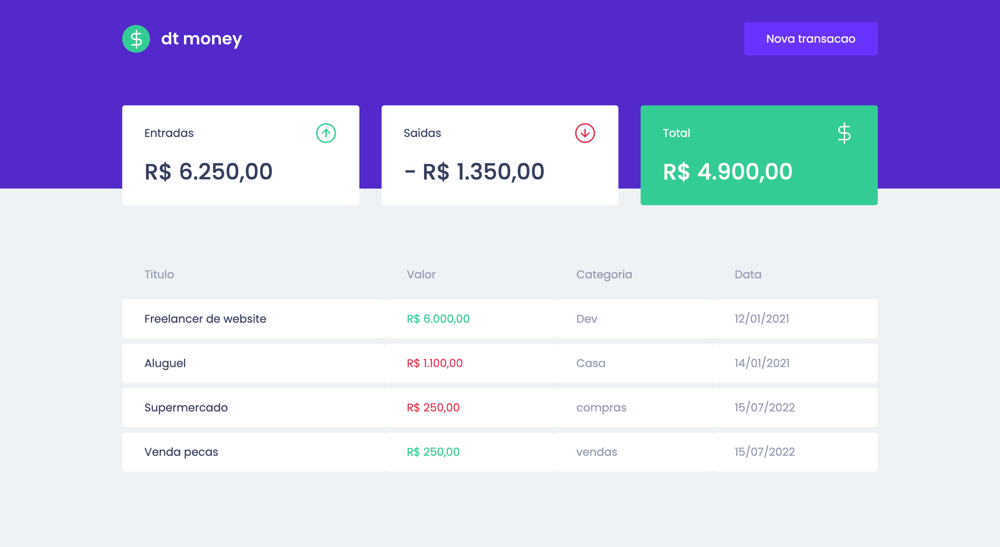

<h1 align="center">
    
</h1>

<h1 align="center">
   ♻️ <a href="#"> WCMoney </a>
</h1>

<h3 align="center">
    Your waste collection marketplace. We help the planet to be cleaner!
</h3>

<p align="center">
  

  

  <a href="https://www.twitter.com/wandchavesbr/">
    
  </a>
  
  <a href="https://github.com/wandersonchaves/wcmoney/commits/master">
    
  </a>
    
   
   <a href="https://github.com/wandersonchaves/wcmoney/stargazers">
    
  </a>

  <a href="https://chav3x.com.br">
    
  </a>
  
  <a href="https://blog.chav3x.com.br/">
    
    </a> 
</p>


<h4 align="center"> 
	 Status: Finished
</h4>

<p align="center">
 <a href="#about">About</a> •
 <a href="#features">Features</a> •
 <a href="#layout">Layout</a> • 
 <a href="#how-it-works">How it works</a> • 
 <a href="#tech-stack">Tech Stack</a> • 
 <a href="#contributors">Contributors</a> • 
 <a href="#author">Author</a> • 
 <a href="#user-content-license">License</a>

</p>


## About

♻️ WCMoney - is an application where your main objective is to be a financial manager.

---

## Features

- [x] be a financial manager.

---

## How it works

This project has a part:
1. Frontend

💡OR Front End needs Backend to be running to work.

### Pre-requisites

Before you begin, you will need to have the following tools installed on your machine:
[Git] (https://git-scm.com), [Node.js] (https://nodejs.org/en/).
In addition, it is good to have an editor to work with the code like [VSCode] (https://code.visualstudio.com/)

#### Rodando o Frontend

```bash

# Clone this repository
$ git clone git@github.com:wandersonchaves/wcmoney.git

# Access the project folder cmd/terminal
$ cd wcmoney

# install the dependencies
$ yarn or yarn install

# Run the application in development mode
$ yarn start 

# The server will start at port: 3333 - go to http://localhost:3333

```

---

## Tech Stack

The following tools were used in the construction of the project:

#### **Website**  ([React](https://reactjs.org/)  +  [TypeScript](https://www.typescriptlang.org/) + [NodeJS](https://nodejs.org/en/))

-   **[Axios](https://github.com/axios/axios)**
-   **[MirageJS](https://miragejs.com/)**
-   **[Styled-Components](https://styled-components.com/)**

> See the file  [package.json](https://github.com/wandersonchaves/wcmoney/blob/master/web/package.json)

#### [](https://github.com/wandersonchaves/wcmoney#utilit%C3%A1rios)**Utilitários**

-   Markdown:  **[StackEdit](https://stackedit.io/)**,  **[Markdown Emoji](https://gist.github.com/rxaviers/7360908)**
-   Fonts:  **[Roboto](https://fonts.google.com/specimen/Roboto)**

---

## Contributors

A big thanks to this group that made this product leave the field of idea and enter the app stores :)

You are an awesome team! :)

<table>
  <tr>
    <td align="center"><a href="https://chav3x.com.br"><br /><sub><b>Wanderson Chaves</b></sub></a><br /><a href="https://chav3x.com.br/" title="Chav3x"></a></td>
  </tr>
</table>

## How to contribute

1. Fork the project.
2. Create a new branch with your changes: `git checkout -b my-feature`
3. Save your changes and create a commit message telling you what you did: `git commit -m" feature: My new feature "`
4. Submit your changes: `git push origin my-feature`
> If you have any questions check this [guide on how to contribute](./CONTRIBUTING.md)

---

## Author

<a href="https://blog.chav3x.com.br/author/wanderson/">
 
 <br />
 <sub><b>Wanderson Chaves</b></sub></a> <a href="https://blog.chav3x.com.br/author/wanderson/" title="Chav3x"></a>
 <br />

[](https://twitter.com/wandchavesbr) [](https://www.linkedin.com/in/wanderson-chaves/) 
[](mailto:wandersonscpibr@gmail.com)

---

## License

This project is under the license [MIT](./LICENSE).

Made with love by Wanderson Chaves 👋🏽 [Get in Touch!](Https://www.linkedin.com/in/wanderson-chaves/)

---

##  Versions of README

[Portuguese](./README.md)  |  [English](./README-en.md)